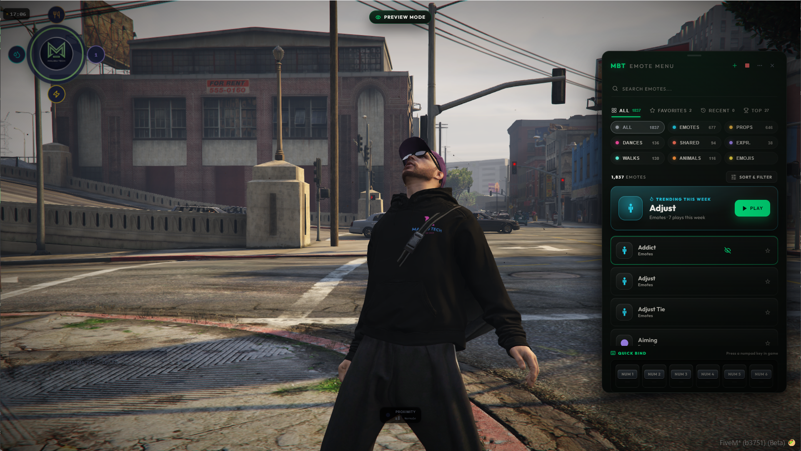
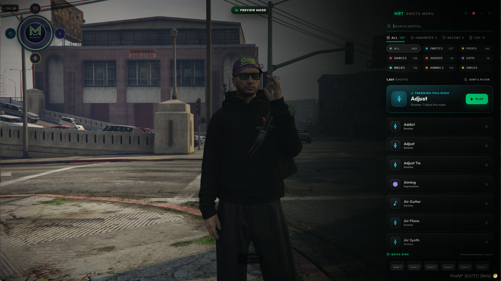

# MBT Emote Menu — Premium NUI for rpemotes-reborn

<p align="center">
  
  
  
  
  
  
</p>

<p align="center">
   
</p>

**mbt_emote_menu** is a premium NUI overlay that completely replaces the default rpemotes-reborn menu with a modern, responsive, and feature-rich interface built with React + TypeScript. Designed for serious RP servers that demand a polished player experience.

> [!IMPORTANT]
> **Requires [rpemotes-reborn](https://github.com/alberttheprince/rpemotes-reborn) 2.1.2 or newer.** Since 1.7.0 the menu reads the emote catalog through rpemotes' `GetEmoteCatalog` export and plays every emote through `Execute`. There is no fallback: on an older rpemotes the menu stays disabled and prints a notice in the server console. Update rpemotes-reborn first, then this resource.

---

## Preview

| Default Layout | Cinematic Layout |
|:-:|:-:|
|  |  |

---

## Features

### Core

- **1800+ emotes** organized by category with **silhouette icons** (Emotes, Props, Dances, Shared, Expressions, Walk Styles, Animals, Emojis) — the whole catalog is read live from rpemotes-reborn, so anything you add there shows up here with no extra work
- **Emoji reactions** powered by rpemotes-reborn's own emoji system (networked, distance-filtered and rate-limited by rpemotes)
- **Real-time search** with instant filtering across all emotes
- **Two layout modes** *(fully redesigned in 1.4)* — *Default* (a bounded, draggable floating panel) and *Cinematic* (an edge-docked, vignette-blended immersive overlay)
- **Left or right positioning** — configurable panel side
- **Draggable menu** — click and drag the header to reposition (default layout)
- **Fully responsive** — optimized breakpoints for 720p, 1080p, 1440p, 4K, and ultrawide monitors (21:9, 32:9)

### Organization

- **Favorites** system with import/export (JSON) and drag-to-reorder
- **Recent emotes** — automatically tracks your last played emotes
- **Top emotes** — ranked by your personal play count
- **Trending this week** *(new in 1.4)* — a server-wide hero spotlight showing the single most-played emote across everyone on the server, on a rolling 7-day window (aggregate counts only, no per-player tracking)
- **Custom lists** — create personal collections with custom names and icons
- **Category filters** — filter by Props, Shared, or browse All
- **Sorting & filter** — A-Z, Z-A, or by category, plus a one-click random emote

### Quick Access

- **Quick Bind** — assign emotes to NUM1-NUM6 keys via right-click drawer
- **Emote Wheel** — hold-to-peek selector (up to 8 slots, no cursor needed). *(new in 1.6)* A **radial / gesture mode** lets you flick the mouse toward a slot, weapon-wheel style, instead of scrolling — switchable via `MBT.EmoteWheel.Mode`
- **Personas / Loadouts** *(new in 1.6)* — save named loadouts (e.g. "Cop", "Party") bundling your Quick Binds and Wheel slots, and switch between them in one click. The active loadout auto-saves as you edit; a non-deletable "Default" is always there as a fallback
- **Keyboard navigation** — arrow keys + Enter to browse and play emotes
- **Smart search** *(new in 1.6)* — search now matches an emote's prop and animation too, not just its name, so "radio" finds the walkie-talkie emotes
- **Random emote** button for spontaneous fun

### Playback

- **Emote preview** — see the animation on your ped before committing (solo, invisible to others)
- **Place in world** — drop an emote at a precise spot via rpemotes-reborn's WASD placement flow, with a branded in-game HUD overlay
- **Playlist system** — queue multiple emotes in sequence with play/stop/clear controls
- **Shared emote popup** — inline accept/decline for sync emote invitations
- **Partner finder** — locate nearby players for shared animations
- **Remember State** — menu remembers your scroll position, tab, and filters after playing an emote (resets on ESC/X, configurable)

### Social & Discovery *(new in 1.3)*

- **Open Join** — when you start a broadcast-eligible emote (dances, shared, ...), every player within radius gets a small anonymous pill (`Join: <emote> [Y]`) and can press one key to play the same emote. Initiator is never named. Per-player opt-out via `/mbt_openjoin off`. Pill auto-dismisses when the initiator walks off or stops, no manual cleanup needed
- **What's That Emote?** — passive discovery. Walk near someone who is emoting and a floating bubble above their head shows the emote name with a hotkey hint — one press copies it onto your own character. Off by default (opt-in via `MBT.Features.WhatsThat`)
- **Nearby ribbon** — when at least one player is in proximity, a dedicated ribbon surfaces above the category pills with your most-played shared / duet emotes, ranked by personal play count. One-click to start a duet with the closest player via the Partner Finder
- **Premium motion language** — entry / exit animations on every social surface (slide + scale-up + accent ring pulse on arrival, snappy 150ms scale-down on exit), tail anchors on the floating bubble, smooth tab transitions via the View Transitions API. Respects `prefers-reduced-motion`

### Roleplay & Expression *(new in 1.5)*

- **RP Text** — `/me` and `/do` commands that float a styled pill above your head describing an action, visible to nearby players. Configurable channels with per-channel command name, range, and color. Server-side length clamp, sanitization, and throttle. Fully toggleable via `MBT.RpText.Enabled`

### Creator Tools *(new in 1.6)*

- **Photo Mode** — a cinematic camera opened from a button in the menu header. Drag to orbit the camera around your character, scroll to zoom, pick a look filter (cinematic, noir, warm, vibrant, cool), toggle depth-of-field and a rule-of-thirds framing grid, then capture — the MBT watermark rides on every shot. Optionally, the server owner can wire a Discord webhook so players send shots straight to a channel (per-player throttled; the upload runs client-side via `screenshot-basic`, so the webhook is handed to the uploading client — a write-only webhook, rotate it if abused). Uses `screenshot-basic` when present, falls back to "hide HUD + your own screenshot key" otherwise. Fully tunable via `MBT.PhotoMode`

- **Photo Mode Pro** *(new in 1.8)* — a **key light** you place yourself, positioned relative to the camera so it keeps the same relationship to the shot however far you orbit: front, side or rim, with strength and warmth. Warmth runs between real white points (tungsten, daylight, open shade) rather than a hue tint, so it reads as a lamp and not as a filter. Plus **hour and sky**: dawn, noon, golden hour, night or any hour on a slider, and seven weather presets. Both are **client-side and yours alone** — the sun moves for the photographer and for nobody else, and everything is handed back when Photo Mode closes. Each half has its own switch (`MBT.PhotoMode.Lighting`, `MBT.PhotoMode.Environment`), and a switched-off tab disappears rather than showing controls that do nothing

### Scene Editor *(new in 1.8)*

- **Place scenes in the world, in-game** — walk to where an actor should stand, face the way they should face, press a key. That is the mark. No coordinates to copy out of a dev tool, no Lua to edit
- **Spots** — a single mark with an emote. Walk into it and a prompt offers the action: lean on the bar, address the podium, sit on the cell bunk. Your MLOs stop needing a board of `/e` commands taped to the wall
- **Multi-actor scenes** — several marks, each with its own emote *and its own role name*. A wedding, an interrogation, a mugshot, an awards photo. Nearby players get a role card, walk to their mark, ready up, and everyone hits their pose on a shared countdown
- **Built by you, not by us** — every server ends up with different scenes on different MLOs. This is not a fixed list of animations we picked
- **Survives updates** — scenes live in your database, not in the resource folder, so dropping a new version over the old one never touches your work
- **Admin only** — the editor is behind an ACE permission, server-side. Ordinary players see the scenes, never the editor
- **One door** — the shield icon in the menu header opens a small menu: *Scene editor* or *Settings*. The install state, the version and the update notice live under Settings, where you look for them once and then never again

### Server Colour *(new in 1.8)*

- **Pick your server's accent in game** — shield → Settings → a colour picker with
  a hex / `rgb()` field. It applies to every player at once, without a restart,
  and it is remembered across them
- **The whole UI follows it**, not just the highlights: panels, cards and world
  prompts take the accent's hue at the lightness they already had
- **It tells you when a colour will not read** — a live contrast figure against
  the panel, flagged below 3:1. A warning, not a veto
- **Admin only**, behind the same ACE as the scene editor. The server never sends
  the panel to anyone else

### Player Settings *(new in 1.7)*

- **Per-player settings popover** — a "..." menu in the header where each player configures the menu for themselves, and it is remembered: **layout** (standard or cinematic, lockable with `MBT.Menu.AllowLayoutSwitch`), **panel side**, **emote wheel mode** (radial or linear), **UI language**, **close on play**, and an **accent preset** (opt-in via `MBT.Theme.AllowAccentChange`)
- **Performance mode** — turns off ambient effects, vignette, entrance animation and hover preview for steadier FPS on weaker machines

### Reliability

- **Auto-close on death** — the menu closes itself if the player ped dies while it is open, avoiding stuck UI during the respawn / death camera
- **Version Check** — notifies server owners when a new release is available on GitHub: a line in the server console, plus an in-menu notice for admins only (see Admin Access). Regular players never see it
- **Resource Name Guard** — prevents the resource from starting if the folder is renamed (avoids silent breakage)

### Permissions & Security

- **Job-locked emotes** — restrict specific emotes to certain jobs (police, mechanic, medic, etc.)
- **ACE-gated admin surface** — the update notice, the owner diagnostics and the scene editor are unlocked by one FiveM ACE permission, checked server-side on every request. A player without it is answered with silence: the payload never leaves the server, so there is nothing client-side that has to be trusted to hide it
- **Banned emotes blacklist** — server owners can blocklist specific emote names server-side; both the catalog and the social broadcast layer filter them out
- **Per-source rate limiting** — every NetEvent the menu accepts is throttled per server ID (catalog request, job lookup, ecosystem status, social broadcast). Prevents a malicious or buggy client from flooding the server
- **Anti-spam cooldown** — client-side cooldown between back-to-back emote plays (`MBT.AntiSpam.CooldownMs`, default 250ms), with a separate cooldown on social broadcasts (default 3s per source)
- **Large-server safety** — Open Join announcements cap at the N closest recipients (`MBT.OpenJoin.MaxRecipients`, default 30) so a 1000-player server doesn't fan-out into a network storm at busy zones
- **Anti-spoofing** — server validates the initiator's replicated `mbtCurrentEmote` state bag against the announced emote before relaying, blocking clients that try to advertise an emote they aren't actually playing
- **Hardened roleplay text** — `/me` and `/do` messages are sanitized and length-clamped server-side, then rendered as escaped text (never raw HTML), so a player cannot inject markup onto other players' screens. The broadcast is distance-filtered and per-player throttled
- **Multi-framework support** — auto-detects ESX, QBox, QBCore, or standalone

### Ecosystem

- **MBT Meta Clothes** integration — detects and connects with `mbt_meta_clothes`
- **MBT Wearable Props** integration — detects and connects with `mbt_wearable_props`

### Localization

Built-in translations for **6 languages**: English, Italian, Spanish, French, German, Portuguese. Add your own by creating a new file in the `locales/` folder.

---

## Requirements

| Dependency | Version |
|---|---|
| [FiveM Server](https://fivem.net) | Build 6116+ |
| OneSync | Enabled |
| [rpemotes-reborn](https://github.com/alberttheprince/rpemotes-reborn) | **2.1.2+** (hard requirement) |

---

## Installation

1. Update [rpemotes-reborn](https://github.com/alberttheprince/rpemotes-reborn) to **2.1.2 or newer** first. The menu will not run on anything older.

2. Download the latest [release](https://github.com/MalibuTechTeam/mbt_emote_menu/releases) into your server's `resources` folder.

3. Add to your `server.cfg`:
   ```cfg
   ensure rpemotes-reborn
   ensure mbt_emote_menu
   ```
   > **Important:** `mbt_emote_menu` must start **after** `rpemotes-reborn`.

4. Configure `config.lua` to your liking (see Configuration below).

   > There are two Lua files at the root. **`config.lua` is yours** and we never
   > touch it. **`default.lua` is ours** — the factory values, overwritten by
   > every update. Most of what used to need a file edit is now in the in-game
   > admin panel anyway.

5. Restart your server or run `ensure mbt_emote_menu` in the live console.

---

## Configuration

All configuration is done in `config.lua`. Here's an overview of each section:

### General

```lua
MBT.Language = 'en'           -- 'en', 'it', 'es', 'fr', 'de', 'pt'
MBT.Debug = false             -- Enable debug logs
MBT.RpemotesResource = nil    -- Auto-detect or force: 'rpemotes-reborn', 'rpemotes', 'rp-emotes'
```

### Menu

```lua
MBT.Menu = {
    Keybind            = 'F4',
    Command            = 'mbt_emotes',
    Layout             = 'cinematic',    -- default layout: 'default' or 'cinematic'
    AllowLayoutSwitch  = true,           -- let players pick their layout in the settings (false = lock to Layout)
    Position           = 'right',        -- default panel side: 'left' or 'right' (players can change theirs)
    CloseOnPlay        = true,           -- players can change theirs in the settings
    RememberState      = true,           -- Remember scroll/tab/filters after playing (resets on ESC/X)
    Watermark          = true,
    OverrideNativeMenu = true,           -- Replaces rpemotes' NativeUI menu
}
```

### Features

```lua
MBT.Features = {
    Favorites      = true,
    RecentEmotes   = true,
    MaxRecent      = 12,
    QuickBind      = true,
    SharedPopup    = true,
    PreviewPed     = true,
    EmoteWheel     = true,
    Personas       = true,    -- saved loadouts: named Quick Bind + Wheel setups
    EmotePlacement = true,    -- "Place in world" button (needs rpemotes-reborn placement export)
    OpenJoin       = true,    -- anonymous proximity group emotes
    WhatsThat      = false,   -- peek-and-copy bubble above nearby emoting players (opt-in)
}
```

> 18+ and movement-exploit ("abusable") emotes are controlled by **rpemotes-reborn itself** (`AdultEmotesDisabled` / `AbusableEmotesDisabled` in its `config.lua`). The menu shows whatever rpemotes exposes, so set those there.

### Emote Wheel

```lua
MBT.EmoteWheel = {
    Key                = 'K',      -- Hold to open
    Slots              = 8,        -- Max 8 slots
    RemoveKey          = 'X',      -- Remove emote from current slot while wheel is open
    Mode               = 'radial', -- 'radial' = flick the mouse toward a slot · 'linear' = scroll
    PointerSensitivity = 2.8,      -- radial only: flick pointer speed
}
```

### Personas

```lua
MBT.Features.Personas = true   -- Saved loadouts (Quick Bind + Wheel) you switch between
MBT.Personas = {
    Max = 4,   -- Maximum number of loadouts a player can create
}
```

### Photo Mode

Drag to orbit, **right-drag to slide the framing**, scroll to zoom. The framing
is what lets you photograph the people next to you instead of only yourself; it
is deliberately bounded, so it stays a camera rather than becoming a free one.

```lua
MBT.PhotoMode = {
    Enabled   = true,   -- Camera button in the menu header
    Watermark = true,   -- MBT watermark on the framing overlay
    DofDefault = true,  -- Start with depth-of-field on
    Filters = { --[[ look presets via timecycle modifiers ]] },
    -- Key light, placed relative to the camera (new in 1.8)
    Lighting = {
        Enabled          = true,    -- false hides the Light tab entirely
        DefaultOn        = false,
        DefaultIntensity = 3.0,     -- 0.5 - 8.0
        DefaultWarmth    = 0.0,     -- -1.0 cool ... 0 daylight ... +1.0 tungsten
        DefaultKey       = 'front', -- 'front' | 'side' | 'rim'
        Range            = 5.0,     -- metres the light reaches
    },

    -- Hour and sky, for the photographer only (new in 1.8)
    Environment = {
        Enabled  = true,  -- false hides the Scene tab entirely
        Weathers = { --[[ id + label pairs, in the order they appear ]] },
    },

    Discord = {
        Enabled    = false, -- Owner opt-in: "Send to Discord" button
        WebhookUrl = '',    -- Handed to the uploading client (write-only webhook)
        ThrottleMs = 30000, -- Per-player cooldown between sends
    },
}
```

**Read this before you promise the sky to anyone.** `Environment` overrides the
hour and weather with client-side natives, so it changes nothing for other
players and is released when Photo Mode closes. But almost every server runs a
weather sync (vSync, cd_easytime, qb-weathersync and friends) that pushes its
own state back every few seconds. We re-assert ours on a 1.5 s beat to stay on
top of it, which works against the common ones — it is **not** guaranteed
against all of them. Set `Environment.Enabled = false` if your weather script
wins the argument, or if you would rather players did not touch the sky at
all.

### Trending

```lua
MBT.Trending = {
    Enabled             = true,  -- Server-wide "Trending this week" hero card
    WindowDays          = 7,     -- Rolling window length, in days
    MinPlays            = 10,    -- Minimum window score for an emote to qualify
    SaveIntervalMinutes = 10,    -- How often counts are flushed to KVP
}
```

### RP Text

```lua
MBT.RpText = {
    Enabled    = true,   -- Master toggle
    MaxLength  = 110,    -- Max characters per message
    DurationMs = 6500,   -- How long the pill stays up
    ThrottleMs = 1000,   -- Per-player cooldown between messages
    HeadOffset = 0.25,   -- Pill height above the head, in meters
    Channels = {         -- Rename a command to avoid clashing with another /me system
        { id = 'me', command = 'me', label = 'ME', range = 16.0, color = '00e676' },
        { id = 'do', command = 'do', label = 'DO', range = 16.0, color = '7fa8c9' },
    },
}
```

### Theme *(moved in 1.8)*

**The colours are no longer in `config.lua`.** They ship in `default.lua`, and
you change them **in game** — shield icon → Settings → pick a colour → Apply.
It applies to everyone on the server, immediately, with no restart, and it
survives one because it is stored server-side.

One switch stays in `config.lua`, because it is a policy and not a colour:

```lua
MBT.Theme = MBT.Theme or {}
MBT.Theme.AllowAccentChange = false  -- true = players may pick their own accent preset
```

The shipped values live in `default.lua`:

```lua
MBT.Theme = {
    Accent            = '00e676', -- the one that matters; the admin panel overrides it per server
    AllowAccentChange = false,
    Background        = '0C0E14', -- legacy, unused
    Card              = '121814', -- legacy, unused
    Text              = 'E8E8EE', -- primary text
    SubText           = '8A93A6', -- secondary text
    Border            = '1A1D26', -- internal dividers
}
```

`Background` and `Card` no longer drive anything — the surfaces derive from the
accent now. They are left in place rather than removed mid-release.

> `default.lua` is **ours**, not yours: an update overwrites it. Editing it works,
> but anything you change there comes back on the next release. `config.lua` is
> the file we never touch.

**Every surface derives from the accent.** The panels are not a fixed colour with
a coloured highlight on top — they carry the accent's own hue at a fixed
lightness, so choosing amber turns the cards amber and choosing a near-grey
leaves them near-grey. Text stays between 14:1 and 15:1 against the panel for
every colour, because only the hue moves.

The picker shows the contrast of your accent against the panel and warns below
3:1 — that is where the *state* lives (ready slots, active chips), so a colour
that sinks into its own panel stops being readable. It warns; it never blocks.
It is your server.

**Reset** clears the stored choice and returns to the shipped value. It deletes
the key rather than writing today's default into it, so a future release that
ships a different colour still reaches you.

### Admin Access

The update notice, the owner diagnostics, the scene editor and the server colour
are all unlocked by one ACE permission. Following the MBT convention, **the admin command is the
resource name** and the permission derives from it:

```
/mbt_emote_menu          opens the scene editor
command.mbt_emote_menu   the ACE it checks
```

FiveM registers that ACE automatically, and it is already covered by the wildcard
most servers run:

```cfg
add_ace group.admin command allow
add_principal identifier.license:XXXXXXXX group.admin
```

So on a typical server **no extra line is needed**. Only add one if your admin
group does not use the `command` wildcard:

```cfg
add_ace group.admin command.mbt_emote_menu allow
```

```lua
MBT.Admin = {
    Command    = 'mbt_emote_menu', -- /mbt_emote_menu opens the scene editor
    Permission = nil,              -- nil -> 'command.' .. Command

    UpdateNotice = {
        Enabled    = true,
    },

    Editor = {
        Enabled   = true,
        MaxMarks  = 12,   -- per scene
        MaxScenes = 200,  -- per server
    },
}
```

Scenes authored in-game are stored in MySQL, in `mbt_emote_menu_scenes`, one row
per scene. The table is created automatically on first boot — there is no SQL
file to import. They survive script updates and are covered by your normal
database backups.

This is the resource's only database dependency (`oxmysql`). If it is missing or
the connection fails, the scene editor turns itself off and says so in console;
everything else in the menu keeps working.

### Scenes & Spots *(new in 1.8)*

Where the scenes an admin authors *behave*. The scenes themselves live in the
database, not here — an owner places them in the world instead of typing
coordinates.

```lua
MBT.VenueSpots = {
    Enabled = true,
    PollMs  = 750,  -- How often we check whether you walked into one
    Key     = 'E',  -- Shown in the prompt

    CountdownFrom = 5, -- Seconds before a multi-actor scene fires

    -- Place the player exactly on the mark before the emote runs. This is the
    -- point of authoring a position: an emote that leans on a counter only
    -- looks right from the spot and angle it was placed at.
    SnapToMark = true,
}
```

### Job Permissions

```lua
MBT.JobPermissions = {
    Enabled   = true,
    Framework = 'auto',    -- 'auto', 'esx', 'qbox', 'qbcore', 'standalone'
    Emotes = {
        ['handcuff'] = { 'police', 'sheriff' },
        ['mechanic'] = { 'mechanic', 'bennys' },
    },
}
```

### Categories

Toggle visibility or reorder categories in the menu:

```lua
MBT.Categories = {
    { type = 'Emotes',       label = 'Emotes',      icon = 'smile',      visible = true },
    { type = 'PropEmotes',   label = 'Props',        icon = 'package',    visible = true },
    { type = 'Dances',       label = 'Dances',       icon = 'music',      visible = true },
    { type = 'Shared',       label = 'Shared',       icon = 'users',      visible = true },
    { type = 'Expressions',  label = 'Expressions',  icon = 'drama',      visible = true },
    { type = 'Walks',        label = 'Walk Styles',  icon = 'footprints', visible = true },
    { type = 'AnimalEmotes', label = 'Animals',      icon = 'dog',        visible = true },
    { type = 'Emojis',       label = 'Emojis',       icon = 'message-circle', visible = true },
}
```

### Debug

When `MBT.Debug = true`, detailed logs are printed in both server console and client F8 console (including the NUI frontend via `[MBT NUI]` prefix). Useful for troubleshooting emote loading and KVP storage.

### Notifications

The notification function in `config.lua` supports presets for **ox_lib**, **ESX**, **QBCore**, **QBox**, and native GTA notifications. Uncomment the preset that matches your server setup.

---

## Keybinds Reference

| Key | Action |
|---|---|
| `F4` | Open / close emote menu |
| `K` (hold) | Open emote wheel |
| `Mouse Wheel` | Scroll wheel slots (while holding K) |
| `X` | Remove emote from wheel slot (while holding K) |
| `NUM1` — `NUM6` | Play quick-bound emote |
| `Right Click` | Open quick bind / wheel slot drawer on a card |
| `Arrow Keys` | Navigate emote list |
| `Enter` | Play focused emote |
| `ESC` | Close menu |

---

## FAQ

**Q: Can I use this without rpemotes-reborn?**
No. This resource is a UI replacement that depends on rpemotes-reborn for all animation logic and emote data.

**Q: Does it work with ESX, QBox, and QBCore?**
Yes. The job permission system auto-detects your framework (ESX → QBox → QBCore → standalone). You can also force a specific one in config.

**Q: How do I add a new language?**
Create a new file in `locales/` (e.g., `locales/jp.lua`), copy the structure from `en.lua`, translate the strings, and set `MBT.Language = 'jp'` in config.

**Q: My emotes don't show up.**
Make sure `rpemotes-reborn` is started and running before `mbt_emote_menu`. Check the F8 console for errors.

**Q: The menu looks wrong on my ultrawide monitor.**
The UI includes responsive breakpoints for all common resolutions including 2560x1080, 3440x1440, and 5120x1440. If you still experience issues, please open an issue with your resolution.

---

## Acknowledgments

This project would not exist without [**rpemotes-reborn**](https://github.com/alberttheprince/rpemotes-reborn) and the incredible work of its maintainers and contributors. rpemotes-reborn provides the entire animation engine, emote library, and shared emote logic that powers every feature in this menu. We are deeply grateful to the rpemotes-reborn team for building and maintaining such a solid foundation for the FiveM roleplay community.

**mbt_emote_menu** is a third-party UI overlay and is not affiliated with or endorsed by the rpemotes-reborn project. This resource is published with respect for the original project's license and guidelines. If you are part of the rpemotes-reborn team and have any concerns, please reach out to us directly.

---

## Credits

Developed by **Malibu Tech Team**.

Special thanks to:

- **rpemotes-reborn** — for the emote engine and animation library that makes this all possible
- **The FiveM community** — for continuous feedback, testing, and inspiration

---

## Links

- 📖 **Documentation:** [malibutechteam.com/docs](https://malibutechteam.com/docs/mbt-emote-menu/overview)
- 📦 **MBT Emote Menu on MalibuTech:** [malibutechteam.com](https://malibutechteam.com/scripts/7379660)
- 💬 **Support & updates:** [MalibuTech Discord](https://discord.gg/6scYba9AMy)

---
## License

This project is licensed under the [PolyForm Noncommercial License 1.0.0](LICENSE.md).

You are free to use and modify this software for **noncommercial purposes only** — personal use, hobby servers, research, and education. Any commercial use, redistribution for profit, or inclusion in paid products is prohibited without written permission from Malibu Tech Team.

This resource depends on [rpemotes-reborn](https://github.com/alberttheprince/rpemotes-reborn) which is licensed under GPL-3.0. **mbt_emote_menu** does not include or redistribute any rpemotes-reborn source code — it communicates with rpemotes-reborn at runtime through FiveM exports and events.

---

## Media

- **Documentation:** [malibutechteam.com/docs](https://malibutechteam.com/docs/mbt-emote-menu/introduction)
- **Changelog:** [every release](https://github.com/MalibuTechTeam/mbt_emote_menu/releases)

Copyright 2026 MalibuTech.
